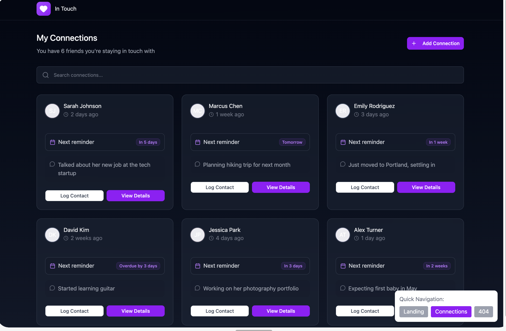
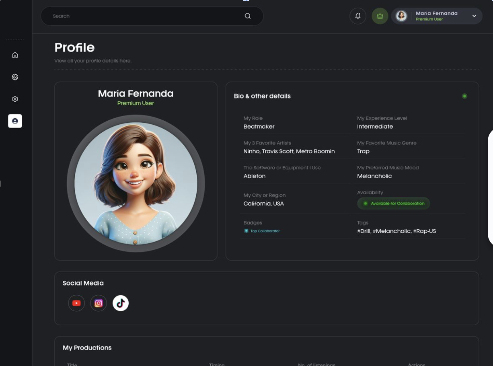
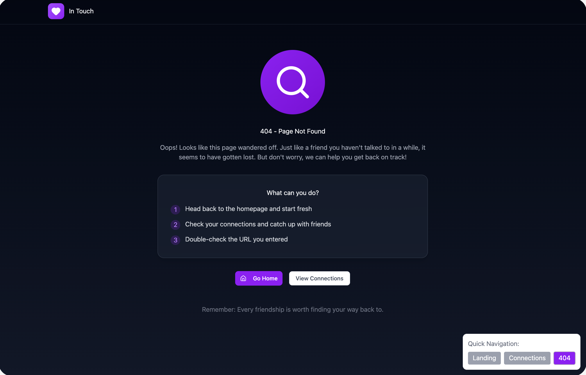
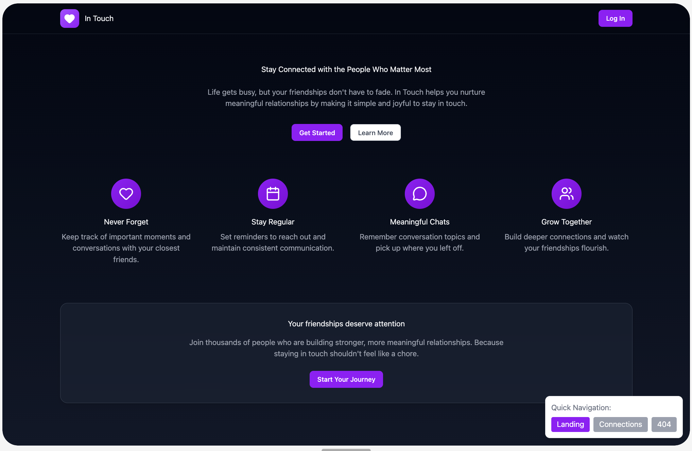

# Wireframes

Reference the Creating an Entity Relationship Diagram final project guide in the course portal for more information about how to complete this deliverable.

## List of Pages

[👉🏾👉🏾👉🏾 List the pages you expect to have in your app, with a ⭐ next to pages you have wireframed]
- Landing/Login Page ⭐
- Profile Page ⭐
- Connections Page ⭐
- 404 Page ⭐
- User to User Boards
- Connections Map View
- Search Users Page

## Wireframe 1: [Connections Page]

[👉🏾👉🏾👉🏾 include wireframe 1]

## Wireframe 2: [Profile Page]

[👉🏾👉🏾👉🏾 include wireframe 2]

## Wireframe 3: [404 Page]

[👉🏾👉🏾👉🏾 include wireframe 3]

[👉🏾👉🏾👉🏾 include more wireframes as desired]

## Wireframe 4: [Landing/Login page]
